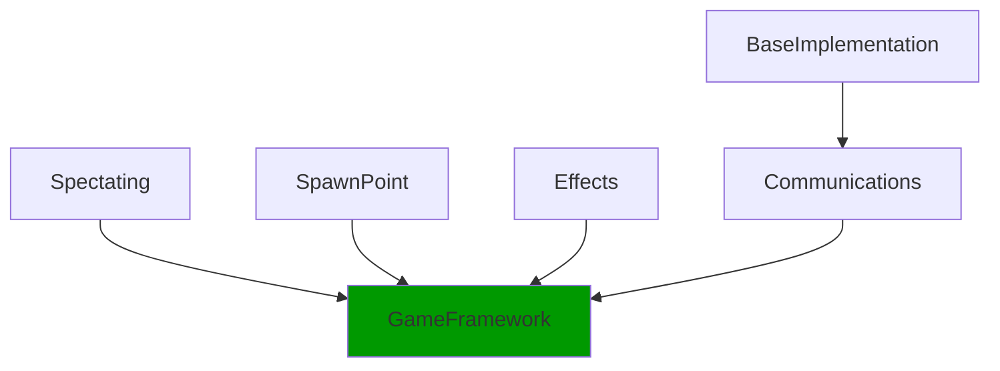

# Unity Game Framework Implementations
A collection of systems that implement unified game interface from [Game Framework](https://github.com/AwesomeProjectionGames/GameFramework) in Unity.

## Modules implemented
- **BaseImplementation**: Core implementations of Game Framework interfaces for Unity, including base classes for actors, controllers, components, and other fundamental systems
  - Others systems can be used standalone without this package, but not the opposite.
- **Spectating**: A spectate system implementation for GameFramework. Provides controllers and components for managing spectating functionality (UIs elements of a certain actor) and camera management.
- **Spawn Point**: An implementation of Spawn Points using the Game Framework interfaces.
- **Effects**: Provides controllers and components for managing objects effects (gameplay / attributes) tied to actors and gameplay events.
- **Communications**: A package that provides common communication mechanisms for Unity Game Framework-based projects, including event buses and tools to facilitate inter-system communication and interfaces workflow in Unity.

## Dependencies


* Packages in green like [Game Framework](https://github.com/AwesomeProjectionGames/GameFramework.git) are not part of this repository.

## Installation
To install these modules, you can use the Unity Package Manager. 
To do so, open the Unity Package Manager and click on the `+` button in the top left corner. 
Then select `Add package from git URL...`.

### Option 1: Full Installation (All Modules)
Includes BaseImplementation, Spectating, SpawnPoint, Effects, and Communications.

```
https://github.com/AwesomeProjectionGames/UnityGameFrameworkImplementations.git
```

Or you can manually add the following line to your `manifest.json` file located in your project's `Packages` directory.

```json
{
  "dependencies": {
    "com.awesomeprojection.gameframework.base": "https://github.com/AwesomeProjectionGames/UnityGameFrameworkImplementations.git",
  }
}
```

### Option 2: Modular Installation
Install only specific modules.

```
https://github.com/AwesomeProjectionGames/UnityGameFrameworkImplementations.git?path=/Spectating
https://github.com/AwesomeProjectionGames/UnityGameFrameworkImplementations.git?path=/SpawnPoint
https://github.com/AwesomeProjectionGames/UnityGameFrameworkImplementations.git?path=/Effects
https://github.com/AwesomeProjectionGames/UnityGameFrameworkImplementations.git?path=/Communications
```

Or you can manually add the following line to your `manifest.json` file located in your project's `Packages` directory (choose the ones you need).

```json
{
  "dependencies": {
    "com.awesomeprojection.gameframework.base": "https://github.com/AwesomeProjectionGames/UnityGameFrameworkImplementations.git",
    "com.awesomeprojection.gameframework.spectating": "https://github.com/AwesomeProjectionGames/UnityGameFrameworkImplementations.git?path=/Spectating",
    "com.awesomeprojection.gameframework.spawnpoint": "https://github.com/AwesomeProjectionGames/UnityGameFrameworkImplementations.git?path=/SpawnPoint",
    "com.awesomeprojection.gameframework.effects": "https://github.com/AwesomeProjectionGames/UnityGameFrameworkImplementations.git?path=/Effects",
    "com.awesomeprojection.gameframework.communications": "https://github.com/AwesomeProjectionGames/UnityGameFrameworkImplementations.git?path=/Communications"
  }
}
```